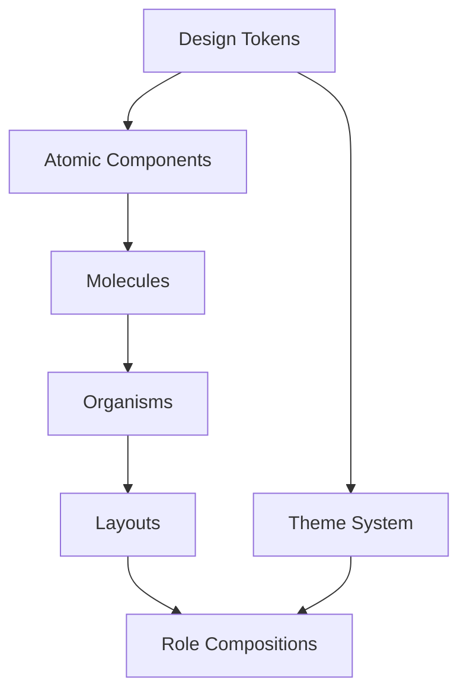

# Architecture Decision Document

_This document builds collaboratively through step-by-step discovery. Sections are appended as we work through each architectural decision together._

## Project Context

**Project:** ĐHTN v3 - Điều hành Tác nghiệp v3
**Scope:** Frontend UI Redesign (API giữ nguyên 100%)
**Target Users:** Lãnh đạo cấp cao (50+ tuổi)

### Scope Constraint

> ⚠️ **CRITICAL:** Dự án này chỉ redesign Frontend UI/UX. Tất cả API calls và backend logic được giữ nguyên 100%.

---

## Project Context Analysis

### Requirements Overview

**Functional Requirements (23 FRs):**

| Category               | FRs     | Key Capabilities                                          |
| ---------------------- | ------- | --------------------------------------------------------- |
| Dashboard & Navigation | FR1-5   | Role-specific views, Action Required, ≤2 clicks           |
| Document Processing    | FR6-9   | Split-screen 50/50, collapse/expand panels                |
| Task Assignment        | FR10-13 | 1-click assign, workload matrix, progress bar             |
| Document Drafting      | FR14-16 | Rich Text Editor, approval workflow                       |
| Reporting              | FR17-19 | Weekly report widget, submission status                   |
| User Experience        | FR20-23 | Font customization, session warnings, 90% task completion |

**Non-Functional Requirements (15 NFRs):**

| Category        | Critical Targets                                          |
| --------------- | --------------------------------------------------------- |
| Performance     | FCP < 1.5s, TTI < 3s, LCP < 2.5s, Bundle -30%             |
| Usability       | Time to Learn < 30 phút, ≤ 2 clicks, 90% completion (50+) |
| Accessibility   | WCAG 2.1 AA, Font 14px+                                   |
| Compatibility   | **100% API backward compatibility**                       |
| Maintainability | Design System based, 80% doc coverage                     |

### Scale & Complexity

- **Primary Domain:** Frontend Web Application
- **Complexity Level:** High (Govtech, Accessibility-focused)
- **Project Type:** Brownfield Redesign
- **Estimated Architectural Components:** ~30 key UI components

### Technical Constraints & Dependencies

| Constraint          | Implication                                                      |
| ------------------- | ---------------------------------------------------------------- |
| API unchanged 100%  | Cannot add new endpoints, must work with existing data contracts |
| Brownfield codebase | Must coexist with existing Next.js 14 / Radix UI setup           |
| Users 50+ primary   | Accessibility-first design, larger fonts, simpler interactions   |
| Internal network    | Performance targets based on intranet environment                |

### Cross-Cutting Concerns Identified

1. **Accessibility** - Font size, contrast, keyboard navigation → affects ALL components
2. **Performance Optimization** - Code splitting, lazy loading → affects routing & bundling
3. **Role-based UI Variants** - Dashboard per role → affects layout architecture
4. **Design System Refactoring** - TailwindCSS + Radix UI → affects component library

### Existing Tech Stack (Preserved)

| Layer         | Technology              | v3 Status           |
| ------------- | ----------------------- | ------------------- |
| Framework     | Next.js 14 (App Router) | **Keep**            |
| UI Primitives | Radix UI                | **Refactor styles** |
| Styling       | TailwindCSS 3.4         | **Enhance**         |
| Global State  | Zustand 5.0             | **Keep**            |
| Server State  | React Query 5           | **Keep**            |
| Forms         | React Hook Form + Zod   | **Keep**            |
| API Client    | Axios instances         | **Keep unchanged**  |
| i18n          | next-intl               | **Keep**            |

---

## Brownfield Stack Evaluation

### Primary Technology Domain

**Frontend Web Application** - Brownfield Redesign based on existing Next.js 14 codebase.

### Stack Assessment (v2 → v3)

| Component     | v2 Technology         | v2 Version | v3 Decision                        |
| ------------- | --------------------- | ---------- | ---------------------------------- |
| Framework     | Next.js (App Router)  | 14.2.32    | ✅ **Keep**                        |
| Language      | TypeScript            | 5.x        | ✅ **Keep**                        |
| UI Primitives | Radix UI              | Various    | ✅ **Keep** + New Styling          |
| Styling       | TailwindCSS           | 3.4.1      | 🔄 **Enhance** - New Design Tokens |
| Global State  | Zustand               | 5.0.8      | ✅ **Keep**                        |
| Server State  | React Query           | 5.86.0     | ✅ **Keep**                        |
| Forms         | React Hook Form + Zod | 7.63 / 4.1 | ✅ **Keep**                        |
| API Client    | Axios                 | 1.11.0     | ⚠️ **Unchanged 100%**              |
| i18n          | next-intl             | 3.14.1     | ✅ **Keep**                        |

### Selected Approach: Brownfield Design System Refresh

**Rationale:**

1. **Risk Mitigation** - Không thay đổi proven patterns đã hoạt động
2. **API Compatibility** - API layer giữ nguyên 100% theo yêu cầu
3. **Focus on UX** - Tập trung vào presentation layer redesign
4. **Performance** - Optimize existing bundle thay vì thay đổi framework

### v3 Enhancement Strategy

**Design System Refactoring:**

```
src/styles/
├── tokens/
│   ├── colors.css      # Premium Enterprise palette
│   ├── typography.css  # 14px+ base, accessibility
│   └── spacing.css     # Consistent grid
├── components/
│   ├── button.css      # Role-based variants
│   └── dashboard.css   # Split-screen layouts
└── themes/
    ├── default.css     # Standard theme
    └── high-contrast.css # Accessibility
```

**v3 Component Migration Strategy:**

> ⚠️ **IMPORTANT:** Tất cả components mới tạo trong folder `v3/` - không ghi đè v2

```
src/components/
├── v3/                    # NEW v3 components
│   ├── atoms/             # Base components (Button, Input, etc.)
│   ├── molecules/         # Compound components
│   ├── organisms/         # Complex components
│   ├── layouts/           # Layout components (SplitScreen, Dashboard)
│   └── compositions/      # Role-based compositions
│       ├── leader/        # Lãnh đạo Ban dashboard
│       ├── director/      # Lãnh đạo đơn vị dashboard
│       ├── manager/       # Lãnh đạo phòng dashboard
│       ├── clerical/      # Văn thư dashboard
│       ├── assistant/     # Trợ lý dashboard
│       └── admin/         # Admin dashboard
│
├── common/               # v2 components (KEEP - backward compatible)
├── dashboard/            # v2 components (KEEP)
├── dialogs/              # v2 components (KEEP)
└── ...other v2 folders   # KEEP until migrated
```

**Performance Optimizations:**

```typescript
// Code splitting per route
const Dashboard = dynamic(() => import('./Dashboard'), {
  loading: () => <Skeleton />
});

// Lazy loading for heavy components
const PDFViewer = dynamic(() => import('./PDFViewer'), { ssr: false });
const RichTextEditor = dynamic(() => import('./RichTextEditor'));
```

### Architectural Decisions from Stack

| Decision                 | Provided by Stack                         |
| ------------------------ | ----------------------------------------- |
| **Routing**              | Next.js App Router (file-based)           |
| **SSR/SSG**              | Next.js built-in                          |
| **API Layer**            | Existing Axios instances (unchanged)      |
| **State Patterns**       | Zustand (global) + React Query (server)   |
| **Form Handling**        | React Hook Form + Zod validation          |
| **Component Primitives** | Radix UI (accessible by default)          |
| **Styling Strategy**     | TailwindCSS utility-first + Design Tokens |

---

## Core Architectural Decisions

### Decision Priority Analysis

**Already Decided (từ existing stack):**

- Framework: Next.js 14 App Router
- UI Primitives: Radix UI
- State: Zustand + React Query
- API: Axios instances (unchanged 100%)

**Critical Decisions (v3 Redesign):**

| #   | Decision               | Choice                           | Rationale                                          |
| --- | ---------------------- | -------------------------------- | -------------------------------------------------- |
| 1   | Design System          | **Hybrid (CSS Vars + Tailwind)** | Runtime theming cho high contrast + DX consistency |
| 2   | Component Architecture | **Atomic + Composition**         | Maximum reuse, role-based layouts từ atoms         |
| 3   | Layout System          | **Radix Resizable**              | Interactive panels, accessibility built-in         |
| 4   | Performance Strategy   | **Aggressive Optimization**      | Meet -30% bundle target                            |

### Design System Architecture

**Decision:** Hybrid approach với CSS Custom Properties + TailwindCSS aliases

```css
/* src/styles/tokens/colors.css */
:root {
  /* Premium Enterprise Palette */
  --color-primary: 220 95% 45%;
  --color-primary-hover: 220 95% 40%;

  /* Accessibility Tokens */
  --font-size-base: 14px;
  --font-size-lg: 16px;
  --color-text-high-contrast: 0 0% 10%;
}

/* High Contrast Theme */
[data-theme="high-contrast"] {
  --color-primary: 220 100% 35%;
  --color-text: 0 0% 0%;
  --color-background: 0 0% 100%;
}
```

**Tailwind Integration:**

```javascript
// tailwind.config.js
module.exports = {
  theme: {
    extend: {
      colors: {
        primary: "hsl(var(--color-primary))",
        "primary-hover": "hsl(var(--color-primary-hover))",
      },
      fontSize: {
        base: "var(--font-size-base)",
        lg: "var(--font-size-lg)",
      },
    },
  },
};
```

### Component Architecture

**Decision:** Atomic Design + Role-based Composition

```
src/components/
├── atoms/              # Button, Badge, Text, Icon
├── molecules/          # Card, FormField, ListItem
├── organisms/          # DataTable, DocumentPanel, TaskList
├── layouts/
│   ├── DashboardLayout.tsx
│   ├── SplitScreenLayout.tsx    # 50/50 resizable
│   └── FocusModeLayout.tsx      # Collapsed panel
└── compositions/
    ├── leader/         # Role-specific compositions
    │   ├── ActionRequiredSection.tsx
    │   └── KeyTrackingWidget.tsx
    └── staff/
        ├── TodayWorkList.tsx
        └── DraftingPanel.tsx
```

### Layout Architecture

**Decision:** Radix Resizable cho Split-screen layouts

```tsx
// SplitScreenLayout.tsx
import * as ResizablePrimitive from "@radix-ui/react-resizable";

export function SplitScreenLayout({ left, right }) {
  return (
    <ResizablePrimitive.Root direction="horizontal">
      <ResizablePrimitive.Panel defaultSize={50} minSize={30}>
        {left}
      </ResizablePrimitive.Panel>
      <ResizablePrimitive.Handle />
      <ResizablePrimitive.Panel defaultSize={50} minSize={30}>
        {right}
      </ResizablePrimitive.Panel>
    </ResizablePrimitive.Root>
  );
}
```

### Performance Optimization Strategy

**Decision:** Aggressive optimization targeting -30% bundle size

| Technique          | Components Affected                 | Expected Impact |
| ------------------ | ----------------------------------- | --------------- |
| Route splitting    | All pages (Next.js default)         | Automatic       |
| Dynamic imports    | PDFViewer, RichTextEditor, BPMN-JS  | -15% initial    |
| Tree shaking       | ECharts, Recharts (partial imports) | -10%            |
| Image optimization | All images (next/image)             | -5%             |

**Implementation:**

```tsx
// Lazy loading heavy components
const PDFViewer = dynamic(() => import("@/components/PDFViewer"), {
  ssr: false,
  loading: () => <Skeleton className="h-[600px]" />,
});

const RichTextEditor = dynamic(() => import("@/components/RichTextEditor"), {
  loading: () => <Skeleton className="h-[400px]" />,
});

// Partial imports for charts
import { LineChart, BarChart } from "recharts"; // Not: import * from 'recharts'
```

### Decision Impact Analysis

**Implementation Sequence:**

1. Design Tokens & Theme System (Foundation)
2. Atomic Components (Building blocks)
3. Layout Components (Structural)
4. Role-based Compositions (Features)
5. Performance Optimizations (Polish)

**Cross-Component Dependencies:**



---

## Implementation Patterns & Consistency Rules

### Pattern Categories Defined

**Conflict Points Identified:** 6 areas where AI agents could make different choices

### Naming Patterns

| Category        | Pattern                   | Example                     |
| --------------- | ------------------------- | --------------------------- |
| **Components**  | PascalCase                | `ActionRequiredSection.tsx` |
| **Files**       | Match component name      | `ActionRequiredSection.tsx` |
| **CSS Classes** | Tailwind + BEM for custom | `action-required__item`     |
| **Variables**   | camelCase                 | `isDocumentPending`         |
| **Constants**   | UPPER_SNAKE_CASE          | `MAX_DASHBOARD_ITEMS`       |
| **Hooks**       | use + PascalCase          | `useDocumentList`           |

### Structure Patterns

**Component Organization:**

```
src/components/
├── atoms/                    # Smallest UI units
│   ├── Button/
│   │   ├── Button.tsx        # Component
│   │   ├── Button.test.tsx   # Co-located test
│   │   └── index.ts          # Clean export
│   ├── Badge/
│   └── Text/
├── molecules/                # Composed atoms
│   ├── FormField/
│   ├── ListItem/
│   └── Card/
├── organisms/                # Complex components
│   ├── DataTable/
│   ├── DocumentPanel/
│   └── TaskList/
├── layouts/                  # Page layouts
│   ├── DashboardLayout.tsx
│   ├── SplitScreenLayout.tsx
│   └── FocusModeLayout.tsx
└── compositions/             # Role-specific
    ├── leader/
    │   ├── ActionRequiredSection.tsx
    │   └── KeyTrackingWidget.tsx
    └── staff/
        ├── TodayWorkList.tsx
        └── DraftingPanel.tsx
```

**Pattern Rules:**

- ✅ Tests co-located with components (`*.test.tsx`)
- ✅ Each component folder has `index.ts` for clean imports
- ✅ Styles via Tailwind classes (no separate CSS files)
- ✅ Design tokens centralized in `src/styles/tokens/`

### Format Patterns

| Format Type        | Standard           | Note                          |
| ------------------ | ------------------ | ----------------------------- |
| **Date Display**   | `DD/MM/YYYY`       | Vietnamese locale             |
| **DateTime**       | `DD/MM/YYYY HH:mm` | 24-hour format                |
| **API Dates**      | ISO 8601           | Unchanged from API            |
| **Number Display** | `1.234.567`        | Vietnamese thousand separator |

### Loading & Error Patterns

**Loading States (React Query):**

```tsx
// ✅ CORRECT: Use React Query loading states
const { data, isLoading, isError, error } = useDocumentList();

if (isLoading) return <DashboardSkeleton />;
if (isError) return <ErrorFallback error={error} />;

return <DocumentList data={data} />;
```

**Error Handling:**

```tsx
// ✅ CORRECT: ErrorBoundary with role-specific fallback
<ErrorBoundary fallback={<ErrorFallback role={userRole} />}>
  <Dashboard />
</ErrorBoundary>
```

### Accessibility Patterns (MANDATORY)

| Pattern             | Implementation               | Enforcement    |
| ------------------- | ---------------------------- | -------------- |
| Font size ≥ 14px    | `--font-size-base: 14px`     | Design token   |
| Focus visible       | `focus-visible:ring-2`       | Tailwind class |
| Keyboard navigation | Radix UI primitives          | Built-in       |
| ARIA labels         | Required for interactive     | Code review    |
| High contrast       | `data-theme="high-contrast"` | Theme system   |

### Enforcement Guidelines

**All AI Agents MUST:**

1. ✅ Use Atomic Design hierarchy (`atoms/` → `molecules/` → `organisms/`)
2. ✅ Co-locate tests with components (`*.test.tsx` alongside `*.tsx`)
3. ✅ Use design tokens for colors/fonts/spacing (no hardcoded values)
4. ✅ Follow naming conventions (PascalCase components, camelCase variables)
5. ✅ Use React Query for server state, Zustand for global UI state
6. ✅ Apply accessibility patterns (font 14px+, focus-visible, ARIA)
7. ✅ Use existing services for API calls (no direct Axios in components)

**Anti-Patterns (AVOID):**

| ❌ Anti-Pattern                | ✅ Correct Pattern            |
| ------------------------------ | ----------------------------- |
| Inline styles                  | Tailwind classes              |
| Direct API calls in components | Use hooks from `/hooks/data/` |
| New state libraries            | Zustand + React Query only    |
| Custom loading spinners        | Skeleton components           |
| Hardcoded colors               | Design tokens                 |
| Magic numbers                  | Named constants               |

---

## Project Structure & Boundaries

### v3 Enhanced Project Structure (Brownfield)

```
src/
├── app/                      # Next.js App Router (KEEP)
│   ├── layout.tsx            # Root layout + providers
│   ├── page.tsx              # Dashboard home
│   ├── document-in/          # Incoming docs (redesign UI)
│   ├── document-out/         # Outgoing docs (redesign UI)
│   ├── task/                 # Tasks (redesign UI)
│   └── ...
│
├── components/               # RESTRUCTURE: Atomic Design
│   ├── atoms/                # NEW: Button, Badge, Text, Icon
│   │   ├── Button/
│   │   │   ├── Button.tsx
│   │   │   ├── Button.test.tsx
│   │   │   └── index.ts
│   │   └── ...
│   ├── molecules/            # NEW: Card, FormField, ListItem
│   ├── organisms/            # NEW: DataTable, DocumentPanel, TaskList
│   ├── layouts/              # NEW: Dashboard, SplitScreen, Focus
│   │   ├── DashboardLayout.tsx
│   │   ├── SplitScreenLayout.tsx
│   │   └── FocusModeLayout.tsx
│   ├── compositions/         # NEW: Role-specific
│   │   ├── leader/
│   │   │   ├── ActionRequiredSection.tsx
│   │   │   └── KeyTrackingWidget.tsx
│   │   └── staff/
│   │       ├── TodayWorkList.tsx
│   │       └── DraftingPanel.tsx
│   └── ui/                   # KEEP: Radix UI primitives (restyled)
│
├── styles/                   # NEW: Design System
│   ├── tokens/
│   │   ├── colors.css        # Premium Enterprise palette
│   │   ├── typography.css    # 14px+ accessibility
│   │   └── spacing.css       # Grid system
│   ├── themes/
│   │   ├── default.css
│   │   └── high-contrast.css
│   └── globals.css           # ENHANCE: Import tokens
│
├── hooks/                    # KEEP: Custom hooks (unchanged)
│   ├── auth/
│   └── data/
│
├── services/                 # KEEP: Business logic (API unchanged)
├── stores/                   # KEEP: Zustand stores (+ UIPrefsStore)
├── definitions/              # KEEP: TypeScript types
└── lib/                      # KEEP: Library configs
```

### Architectural Boundaries

**API Boundary (100% UNCHANGED):**

```
Frontend Components
       │
       ▼
   React Query Hooks (hooks/data/)
       │
       ▼
   Services Layer (services/)
       │
       ▼
   Axios Instances (api/)
       │
       ▼
   Backend API (NEXT_PUBLIC_API_HOST)
```

**Component Communication Boundary:**

```
atoms → molecules → organisms → layouts → compositions
  ↑                                              ↓
  └──────────── Design Tokens ─────────────────┘
```

**State Boundary:**

| State Type      | Manager         | Examples                                    |
| --------------- | --------------- | ------------------------------------------- |
| **Global UI**   | Zustand         | AuthStore, EncryptStore, UIPrefsStore (NEW) |
| **Server Data** | React Query     | useDocumentList, useTaskList                |
| **Form State**  | React Hook Form | useForm with Zod validation                 |
| **Local State** | useState        | Component-specific toggles                  |

### FR to Structure Mapping

| FR Category                  | v3 Location                                                 |
| ---------------------------- | ----------------------------------------------------------- |
| FR1-5 Dashboard & Navigation | `compositions/leader/`, `compositions/staff/`               |
| FR6-9 Document Processing    | `layouts/SplitScreenLayout.tsx`, `organisms/DocumentPanel/` |
| FR10-13 Task Assignment      | `organisms/WorkloadMatrix/`, `molecules/AssignButton/`      |
| FR14-16 Document Drafting    | `organisms/RichTextEditor/` (lazy loaded)                   |
| FR17-19 Reporting            | `compositions/leader/WeeklyReportWidget/`                   |
| FR20-23 UX/Accessibility     | `styles/tokens/`, Theme system                              |

### Migration Strategy

| Layer               | v2 Location             | v3 Action                             |
| ------------------- | ----------------------- | ------------------------------------- |
| Radix UI primitives | `components/ui/`        | Restyle with new tokens               |
| Common components   | `components/common/`    | Restructure to atoms/molecules        |
| Feature components  | `components/[feature]/` | Restructure to organisms/compositions |
| Services            | `services/`             | **Keep unchanged**                    |
| Data hooks          | `hooks/data/`           | **Keep unchanged**                    |
| API layer           | `api/`                  | **Keep unchanged**                    |

---

## Architecture Validation Results

### Coherence Validation ✅

**Decision Compatibility:**
All technology choices are compatible and work together without conflicts:

- Next.js 14 + Radix UI: Both React-based, actively maintained
- TailwindCSS + CSS Variables: Hybrid approach supports runtime theming
- Zustand + React Query: Complementary state management (global vs server)
- API layer unchanged: No conflicts with UI changes

**Pattern Consistency:**

- Naming conventions consistent (PascalCase components, camelCase variables)
- Atomic Design structure aligns with Radix UI primitives
- Communication patterns have clear boundaries

**Structure Alignment:**

- Project structure supports all architectural decisions
- Boundaries properly defined (API unchanged, components restructured)
- Integration points clearly specified

### Requirements Coverage Validation ✅

**Functional Requirements Coverage:**

| FR Category                  | Architectural Support                | Status |
| ---------------------------- | ------------------------------------ | ------ |
| FR1-5 Dashboard & Navigation | Role compositions, dashboard layouts | ✅     |
| FR6-9 Document Processing    | SplitScreenLayout, DocumentPanel     | ✅     |
| FR10-13 Task Assignment      | WorkloadMatrix, AssignButton         | ✅     |
| FR14-16 Document Drafting    | RichTextEditor (lazy loaded)         | ✅     |
| FR17-19 Reporting            | WeeklyReportWidget                   | ✅     |
| FR20-23 UX/Accessibility     | Design tokens, Theme system          | ✅     |

**Non-Functional Requirements Coverage:**

| NFR Category             | Architectural Strategy                     | Status |
| ------------------------ | ------------------------------------------ | ------ |
| NFR1-4 Performance       | Code splitting, lazy loading, tree shaking | ✅     |
| NFR5-8 Usability         | ≤2 clicks design, role-specific dashboards | ✅     |
| NFR9-11 Accessibility    | 14px+ fonts, WCAG 2.1 AA, high contrast    | ✅     |
| NFR12-13 Compatibility   | API 100% unchanged, modern browsers        | ✅     |
| NFR14-15 Maintainability | Design System, component documentation     | ✅     |

### Implementation Readiness Validation ✅

| Check                      | Status | Notes                               |
| -------------------------- | ------ | ----------------------------------- |
| Decisions have versions    | ✅     | All stack versions specified        |
| Comprehensive patterns     | ✅     | Naming, structure, process patterns |
| Clear project structure    | ✅     | Atomic Design with FR mapping       |
| Migration strategy defined | ✅     | Keep/Restyle/Restructure per layer  |

### Architecture Completeness Checklist

**✅ Requirements Analysis**

- [x] Project context thoroughly analyzed
- [x] Scale and complexity assessed (High - Govtech)
- [x] Technical constraints identified (API unchanged 100%)
- [x] Cross-cutting concerns mapped (Accessibility, Performance)

**✅ Architectural Decisions**

- [x] Critical decisions documented with versions
- [x] Technology stack fully specified
- [x] Integration patterns defined (existing API layer)
- [x] Performance considerations addressed (-30% bundle)

**✅ Implementation Patterns**

- [x] Naming conventions established
- [x] Structure patterns defined (Atomic Design)
- [x] Communication patterns specified (React Query + Zustand)
- [x] Process patterns documented (Loading, Error handling)

**✅ Project Structure**

- [x] Complete directory structure defined
- [x] Component boundaries established (atoms → compositions)
- [x] Integration points mapped
- [x] Requirements to structure mapping complete

### Architecture Readiness Assessment

**Overall Status:** ✅ **READY FOR IMPLEMENTATION**

**Confidence Level:** **HIGH**

_Rationale: Brownfield project with proven stack, clear constraints (API unchanged), comprehensive patterns for AI agents._

**Key Strengths:**

1. **Low Risk** - Keeping proven patterns, only changing presentation layer
2. **Clear Boundaries** - API unchanged, component restructuring defined
3. **Accessibility-First** - Design tokens enforce 14px+ fonts, high contrast
4. **Performance Strategy** - Concrete techniques for -30% bundle target

**Implementation Priority Order:**

1. Design Tokens & Theme System (Foundation)
2. Atomic Components (Building blocks)
3. Layout Components (SplitScreen, Dashboard)
4. Role-based Compositions (Leader, Staff)
5. Performance Optimizations (Lazy loading, tree shaking)

---

## Document Summary

| Section                 | Content                                                                   |
| ----------------------- | ------------------------------------------------------------------------- |
| Project Context         | ĐHTN v3, Frontend Only, API unchanged                                     |
| Stack Evaluation        | Next.js 14, Radix UI, TailwindCSS, Zustand, React Query                   |
| Core Decisions          | Hybrid Design System, Atomic Components, Radix Resizable, Aggressive Perf |
| Implementation Patterns | Naming, Structure, Format, Accessibility patterns                         |
| Project Structure       | Brownfield migration with Atomic Design                                   |
| Validation              | 100% FR/NFR coverage, HIGH confidence                                     |

**Document Status:** ✅ **COMPLETE**

**Next Workflow:** `/bmad-bmm-workflows-create-epics-and-stories`
