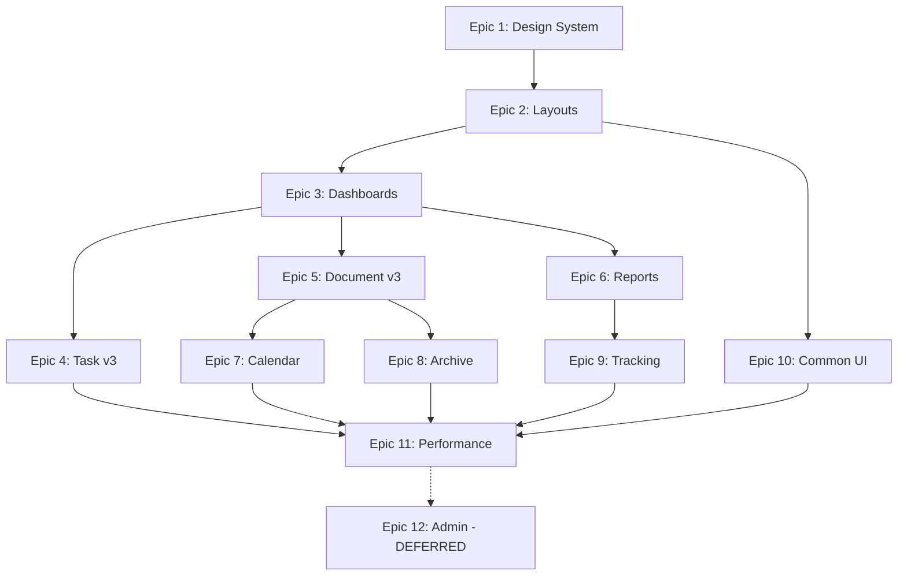

# ĐHTN v3 - Epic Breakdown

## Overview

This document provides the complete epic and story breakdown for ĐHTN v3, decomposing the requirements from the PRD, UX Design, and Architecture requirements into implementable stories.

**Scope Constraint:** Frontend Only - API unchanged 100%

---

## Requirements Inventory

### Functional Requirements

| ID   | Requirement                                                      | Category               |
| ---- | ---------------------------------------------------------------- | ---------------------- |
| FR1  | Users can view role-specific dashboard based on their position   | Dashboard & Navigation |
| FR2  | Leaders can see "Action Required" section with pending items     | Dashboard & Navigation |
| FR3  | Leaders can see "Key Tracking" section with pinned items         | Dashboard & Navigation |
| FR4  | Staff can see "Today's Work" to-do list with personal tasks      | Dashboard & Navigation |
| FR5  | Users can navigate between main sections with ≤2 clicks          | Dashboard & Navigation |
| FR6  | Users can view documents in split-screen layout (50/50)          | Document Processing    |
| FR7  | Leaders can view proposal/reference on left panel                | Document Processing    |
| FR8  | Leaders can view draft/action on right panel                     | Document Processing    |
| FR9  | Users can collapse/expand panels for focus mode                  | Document Processing    |
| FR10 | Department heads can assign tasks with 1-click action            | Task Assignment        |
| FR11 | Department heads can view workload matrix by department          | Task Assignment        |
| FR12 | Users can view task progress via progress bar                    | Task Assignment        |
| FR13 | Users can pin/unpin important items for tracking                 | Task Assignment        |
| FR14 | Staff can create outgoing documents via Rich Text Editor         | Document Drafting      |
| FR15 | Staff can submit drafts for approval to supervisors              | Document Drafting      |
| FR16 | Users can view document history and versions                     | Document Drafting      |
| FR17 | Section heads can view weekly report status widget               | Reporting              |
| FR18 | Section heads can review and submit reports via dedicated button | Reporting              |
| FR19 | Secretaries can view submission status by department             | Reporting              |
| FR20 | Users can customize font size (accessibility)                    | User Experience        |
| FR21 | Users can receive session timeout warnings                       | User Experience        |
| FR22 | New users can learn core tasks within 30 minutes                 | User Experience        |
| FR23 | Users 50+ can complete 90% tasks without assistance              | User Experience        |

**Additional FR (User Request):**

| ID   | Requirement                                                                             | Category        |
| ---- | --------------------------------------------------------------------------------------- | --------------- |
| FR24 | Users can customize theme (dark/light mode, primary color) với localStorage persistence | User Experience |

---

### Non-Functional Requirements

| ID    | Requirement                                | Target              | Priority |
| ----- | ------------------------------------------ | ------------------- | -------- |
| NFR1  | First Contentful Paint (FCP)               | < 1.5s              | Critical |
| NFR2  | Time to Interactive (TTI)                  | < 3s                | Critical |
| NFR3  | Largest Contentful Paint (LCP)             | < 2.5s              | Critical |
| NFR4  | Bundle size reduction vs v2                | ≥ 30%               | High     |
| NFR5  | Time to Learn (core tasks)                 | < 30 phút           | Critical |
| NFR6  | Task completion rate (users 50+)           | ≥ 90%               | Critical |
| NFR7  | Steps to primary actions                   | ≤ 2 clicks          | High     |
| NFR8  | Dashboard items visible                    | ≤ 10 items          | High     |
| NFR9  | WCAG compliance level                      | 2.1 AA              | High     |
| NFR10 | Minimum font size                          | 14px                | Critical |
| NFR11 | Keyboard navigation support                | Basic               | Medium   |
| NFR12 | API backward compatibility                 | 100%                | Critical |
| NFR13 | Browser support (Chrome/Edge/Firefox 100+) | Full                | High     |
| NFR14 | Component reusability                      | Design System based | High     |
| NFR15 | Code documentation coverage                | ≥ 80%               | Medium   |

---

### Additional Requirements

**From Architecture:**

- Hybrid Design System: CSS Variables + TailwindCSS cho runtime theming
- Radix UI primitives: Customize styles, không thay thế
- Atomic Design structure: atoms → molecules → organisms → compositions
- SplitScreenLayout: Radix Resizable cho 50/50 panels
- Dynamic imports: PDFViewer, RichTextEditor, BPMN-JS lazy loaded
- Theme system: `data-theme` attribute cho high-contrast mode
- Co-located tests: `*.test.tsx` alongside components

**From UX Design:**

- Premium Enterprise Look: Deep blues + neutral grays + gold accents
- Font system: 14px base, Inter font stack
- ≤10 items visible on dashboard
- ≤2 clicks for all primary actions
- Split-view layout: 50/50 resizable panels
- Role-specific dashboard compositions
- Experience principle: "Thấy Ngay, Làm Ngay"

**From User Request:**

- Theme customization UI: Dark/Light mode toggle
- Primary color picker/selector
- Theme persistence via localStorage
- Zustand store: UIPrefsStore for theme state

---

### FR Coverage Map

| FR   | Epic   | Mô tả                                           |
| ---- | ------ | ----------------------------------------------- |
| FR1  | Epic 3 | Role-specific dashboard                         |
| FR2  | Epic 3 | Action Required section                         |
| FR3  | Epic 3 | Key Tracking section                            |
| FR4  | Epic 3 | Today's Work to-do                              |
| FR5  | Epic 3 | Navigate ≤2 clicks                              |
| FR6  | Epic 2 | Split-screen 50/50                              |
| FR7  | Epic 2 | Left panel reference                            |
| FR8  | Epic 2 | Right panel action                              |
| FR9  | Epic 2 | Collapse/expand panels                          |
| FR10 | Epic 4 | 1-click assign                                  |
| FR11 | Epic 4 | Workload matrix                                 |
| FR12 | Epic 4 | Progress bar                                    |
| FR13 | Epic 4 | Pin/unpin items                                 |
| FR14 | Epic 5 | Rich Text Editor                                |
| FR15 | Epic 5 | Submit for approval                             |
| FR16 | Epic 5 | Document history                                |
| FR17 | Epic 6 | Weekly report widget                            |
| FR18 | Epic 6 | Submit reports                                  |
| FR19 | Epic 6 | Submission status                               |
| FR20 | Epic 1 | Font size customization                         |
| FR21 | Epic 7 | Session timeout warnings                        |
| FR22 | Epic 7 | Learn within 30 minutes                         |
| FR23 | Epic 7 | 90% completion (50+)                            |
| FR24 | Epic 1 | Theme customization (Dark/Light, primary color) |

## Migration Strategy

> ⚠️ **IMPORTANT:** Tất cả components mới sẽ được tạo trong folder `v3/` thay vì ghi đè v2.
>
> - Components v2 giữ nguyên để đảm bảo backward compatibility
> - Pages chưa redesign vẫn sử dụng v2 components
> - Chuyển đổi dần dần theo từng Epic

---

## Epic List (12 Epics - 100% Coverage)

### Epic 1: Design System Foundation

**Mục tiêu:** Thiết lập nền tảng design tokens và theme system cho toàn bộ v3 components.

**User Outcome:** Người dùng có thể chuyển đổi theme (Dark/Light), chọn primary color, hệ thống lưu preferences vào localStorage.

**Deliverables:**

- `src/styles/v3/tokens/` - Design tokens (colors, typography, spacing)
- `src/styles/v3/themes/` - Theme files (default, high-contrast)
- `src/components/v3/atoms/` - Base atomic components
- `src/stores/uiPrefs.store.ts` - Theme preferences store

**FRs covered:** FR20, FR24
**NFRs addressed:** NFR9, NFR10, NFR14
**Stories:** 4

---

### Epic 2: Core Layout Components

**Mục tiêu:** Xây dựng layout components cốt lõi trên nền Radix UI cho v3.

**User Outcome:** Giao diện split-screen 50/50, collapse/expand panels, responsive layouts.

**Deliverables:**

- `src/components/v3/layouts/SplitScreenLayout.tsx`
- `src/components/v3/layouts/DashboardLayout.tsx`
- `src/components/v3/layouts/FocusModeLayout.tsx`
- `src/components/v3/layouts/PageLayout.tsx`

**FRs covered:** FR6, FR7, FR8, FR9
**NFRs addressed:** NFR7, NFR8
**Stories:** 4

---

### Epic 3: Role-Based Dashboards

**Mục tiêu:** Dashboard tùy theo vai trò với components phù hợp.

**User Outcome:** 6 roles có dashboard riêng, tìm việc cần làm trong ≤2 clicks.

**Pages (1):**

- `/` (Dashboard home)

**Stories (6):**

| Story | Role            | Components                                          | v3 Files                     |
| ----- | --------------- | --------------------------------------------------- | ---------------------------- |
| 3.1   | Lãnh đạo Ban    | ActionRequiredSection, KeyTrackingWidget, UnitStats | `compositions/v3/leader/`    |
| 3.2   | Lãnh đạo đơn vị | WorkloadMatrix, AssignedTasksCard                   | `compositions/v3/director/`  |
| 3.3   | Lãnh đạo phòng  | WeeklyReportWidget, TeamProgressCard                | `compositions/v3/manager/`   |
| 3.4   | Văn thư         | DocumentProcessingWidget, TrackingWidget            | `compositions/v3/clerical/`  |
| 3.5   | Trợ lý          | TodayWorkList, DraftingPanel                        | `compositions/v3/assistant/` |
| 3.6   | Admin           | SystemStatsWidget, QuickAccessLinks                 | `compositions/v3/admin/`     |

**FRs covered:** FR1, FR2, FR3, FR4, FR5
**NFRs addressed:** NFR5, NFR6, NFR7, NFR8

---

### Epic 4: Task Management v3

**Mục tiêu:** Redesign toàn bộ Task v2 UI sang v3 components.

**User Outcome:** Giao việc 1-click, workload matrix, progress tracking với UI mới.

**Pages (21):**

- `/task-v2/dashboard/` - Task dashboard
- `/task-v2/dashboard_phong/` - Department dashboard
- `/task-v2/assign/` - Assigned tasks (2 pages)
- `/task-v2/work/` - Work to do (2 pages)
- `/task-v2/follow/` - Follow tasks (2 pages)
- `/task-v2/combination/` - Combined tasks (2 pages)
- `/task-v2/search/` - Search tasks (2 pages)
- `/task-v2/kpi/` - KPI dashboard
- `/task-v2/statistics/` - Statistics
- `/task-v2/declare/` - Declarations (3 pages)
- `/task-v2/listTaskOrg/` - Org task list (2 pages)
- `/task-v2/regular/` - Regular tasks
- `/task-v2/listdeclare/` - Declaration list

**Components (28):**

- All components in `src/components/task-v2/` → migrate to v3

**FRs covered:** FR10, FR11, FR12, FR13
**NFRs addressed:** NFR7
**Stories:** 8-10

---

### Epic 5: Document Workflow v3

**Mục tiêu:** Redesign toàn bộ Document UI (in + out + internal).

**User Outcome:** Soạn thảo, duyệt, ban hành văn bản với giao diện Premium Enterprise.

**Pages (68):**

| Module            | Pages | Components    |
| ----------------- | ----- | ------------- |
| `/document-out/*` | 42    | 40 components |
| `/document-in/*`  | 14    | 34 components |
| `/doc-internal/*` | 12    | 13 components |

**Sub-stories:**

- 5.1: Document Out - Main/List views
- 5.2: Document Out - Combine/Directive views
- 5.3: Document Out - Follow/Opinion views
- 5.4: Document Out - Search/Detail views
- 5.5: Document In - Draft/Handle views
- 5.6: Document In - Issued/List views
- 5.7: Document In - Search/Important views
- 5.8: Doc Internal - All views

**FRs covered:** FR14, FR15, FR16
**NFRs addressed:** NFR5
**Stories:** 8-10

---

### Epic 6: Reporting & Daily Reports

**Mục tiêu:** Redesign báo cáo tuần/tháng/quý với UI mới.

**User Outcome:** Trưởng phòng xem và nộp báo cáo nhanh chóng.

**Pages (6):**

- `/daily-report/gov/*` - Government reports (3 pages)
- `/daily-report/par/*` - Party reports (3 pages)

**Components:**

- All in `src/components/daily-report/` → migrate to v3

**FRs covered:** FR17, FR18, FR19
**NFRs addressed:** NFR7
**Stories:** 3

---

### Epic 7: Calendar System v3

**Mục tiêu:** Redesign Lịch công tác.

**User Outcome:** Xem lịch Ban/đơn vị, đặt phòng họp với UI mới.

**Pages (10):**

- `/calendar/business/*` - Business calendar (3 pages)
- `/calendar/org-list/` - Org calendar list
- `/calendar/room/` - Room booking

**Components (9):**

- All in `src/components/calendar/` → migrate to v3

**Stories:** 4

---

### Epic 8: Archive & Document Records v3

**Mục tiêu:** Redesign Hồ sơ lưu trữ.

**User Outcome:** Quản lý hồ sơ, phông lưu trữ với UI mới.

**Pages (6):**

- `/document-record/congviec/` - Work records
- `/document-record/coquan/` - Org records
- `/document-record/font/` - Font records (2 pages)
- `/document-record/heading/` - Headings
- `/document-record/personal/` - Personal records

**Components (9):**

- All in `src/components/document-record/` → migrate to v3

**Stories:** 3

---

### Epic 9: Tracking & Search v3

**Mục tiêu:** Redesign theo dõi văn bản và tìm kiếm.

**User Outcome:** Theo dõi tiến trình văn bản, tìm kiếm nhanh.

**Pages (10):**

- `/track-doc/in/*` - Track incoming (2 pages)
- `/track-doc/out/*` - Track outgoing (2 pages)
- `/track-doc/report/` - Tracking report
- `/search-doc/` - Global search
- `/manage-watch-list/*` - Watch list management

**Components:**

- All in `src/components/watch-list/` → migrate to v3

**Stories:** 4

---

### Epic 10: Common UI Components v3

**Mục tiêu:** Migrate common/dialogs/ui components sang v3.

**User Outcome:** Tất cả shared components có giao diện nhất quán.

**Components (100+):**

- `src/components/common/` (35) → v3
- `src/components/dialogs/` (25) → v3
- `src/components/ui/` (41) → v3 styling overrides

**Stories:** 5-6

---

### Epic 11: Performance & UX Polish

**Mục tiêu:** Lazy loading, bundle optimization, onboarding.

**User Outcome:** FCP < 1.5s, Bundle -30%, users 50+ hoàn thành 90% tasks.

**Deliverables:**

- Dynamic imports cho heavy components
- Bundle analysis và tree shaking
- Skeleton loading states
- Session timeout warnings
- Gentle onboarding tooltips

**Pages affected:** All pages

**FRs covered:** FR21, FR22, FR23
**NFRs addressed:** NFR1, NFR2, NFR3, NFR4, NFR6, NFR11
**Stories:** 4

---

### Epic 12: Admin & Utility Modules (DEFERRED)

**Mục tiêu:** Redesign Admin modules, Vehicles, Delegate, Request.

**Status:** ⏸️ **DEFERRED** - User sẽ quyết định sau

**User Outcome:** Quản trị hệ thống với UI mới (optional).

**Pages (33):**

- `/users/*` - User management (2 pages)
- `/organizations/` - Org management
- `/role/` - Role management
- `/categories/` - Categories
- `/workflow-config/*` - Workflow config (3 pages)
- `/form-config/*` - Form config (2 pages)
- `/module_manage/` - Module management
- `/log-business/` - Business logs
- `/template/` - Templates
- `/process/*` - Process config (3 pages)
- `/clerical_org/` - Clerical org
- `/settings/` - Settings
- `/profile/` - User profile
- `/notifications/` - Notifications
- `/manage-vehicle/*` - Vehicles (5 pages)
- `/delegate/*` - Delegate (4 pages)
- `/delegate_flow/` - Delegate flow
- `/retake/*` - Retake documents (4 pages)
- `/request/[typeId]/*` - Request forms (9 pages)

**Note:** Các pages này vẫn sử dụng v2 components cho đến khi Epic 12 được thực hiện.

**Stories:** TBD (10-15 nếu thực hiện)

---

## Epic Summary

| Epic | Tên                        | Pages | Components       | Stories |
| ---- | -------------------------- | ----- | ---------------- | ------- |
| 1    | Design System Foundation   | -     | All (foundation) | 4       |
| 2    | Core Layout Components     | -     | 4 layouts        | 4       |
| 3    | Role-Based Dashboards      | 1     | 18 compositions  | 6       |
| 4    | Task Management v3         | 21    | 28               | 8-10    |
| 5    | Document Workflow v3       | 68    | 87               | 8-10    |
| 6    | Reporting & Daily Reports  | 6     | 4                | 3       |
| 7    | Calendar System v3         | 10    | 9                | 4       |
| 8    | Archive & Document Records | 6     | 9                | 3       |
| 9    | Tracking & Search v3       | 10    | 6                | 4       |
| 10   | Common UI Components v3    | -     | 100+             | 5-6     |
| 11   | Performance & UX Polish    | All   | -                | 4       |
| 12   | Admin & Utility (DEFERRED) | 33    | 30+              | TBD     |

**Total (Epic 1-11):** ~122 pages, ~265 components, **50-58 stories**

---

## Implementation Order

**Recommended Order:**

1. Epic 1 → Epic 2 → Epic 10 (Foundation)
2. Epic 3 (Dashboards)
3. Epic 4 + Epic 5 + Epic 6 (Core Features - parallel)
4. Epic 7 + Epic 8 + Epic 9 (Secondary Features - parallel)
5. Epic 11 (Polish)
6. Epic 12 (If decided)

**Estimated Timeline:** 12-16 sprints (6-8 months)
